## Feed-forward Neural Networks

:::{.incremental style="font-size:60%;"}
- Two limitations of FFNs:
  - They don't account for sequential dependencies
  - They have a fixed input/output size

:::

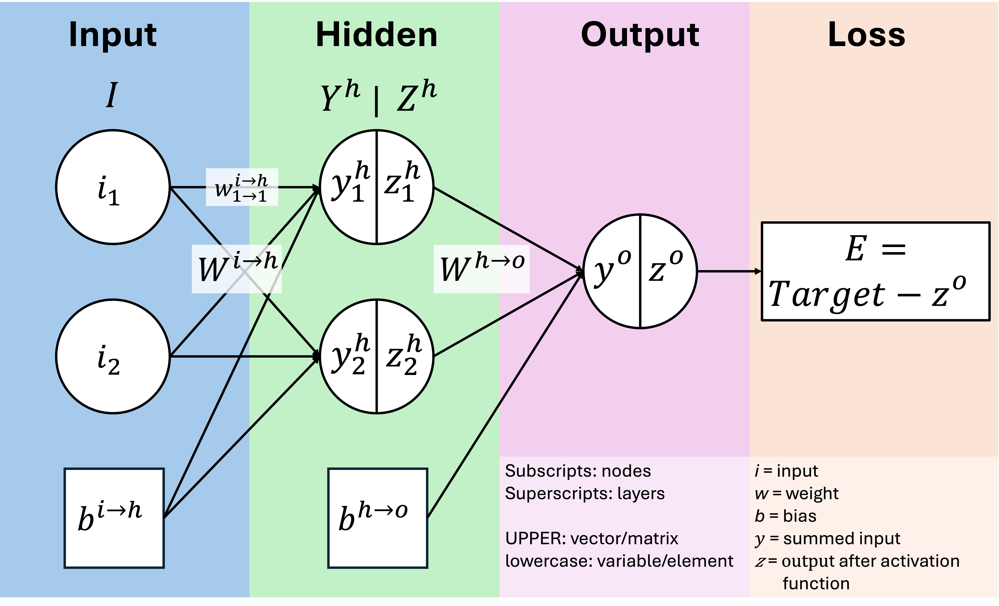

## Recurrent Neural Networks

:::{style="font-size:65%;" .incremental}
- Adds feedback loops 
  - Previous state(s) become part of the next input ("short term memory")
- Allows for processing sequential/temporal data, where order matters
- Can handle sequences of varying lengths, and create outputs of varying lengths

:::

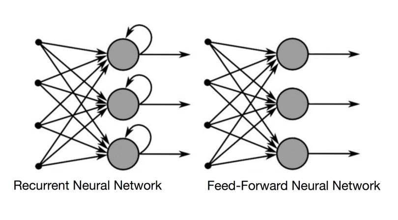

## Recurrent Neural Networks

:::{style="font-size:65%;"}
- Adds feedback loops 
  - Previous state(s) become part of the next input ("short term memory")
- Allows for processing sequential/temporal data, where order matters
- Can handle sequences of varying lengths

:::

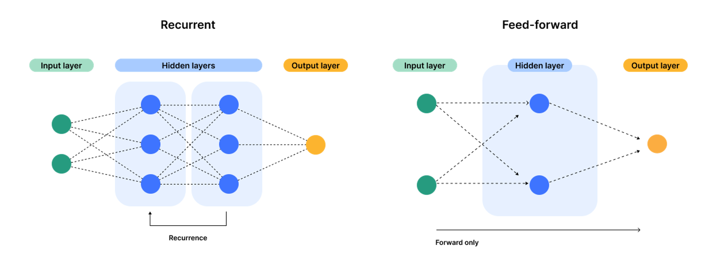

## ANN Benchmarks

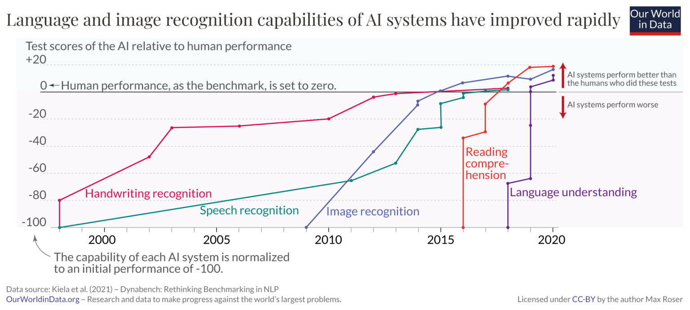

## Common applications of RNNs

:::{.incremental style="font-size:80%;"}
- Text classification (e.g. sentiment analysis)
- Text generation (e.g. image-captioning)
- Translation
- Speech recognition
- Time-series prediction
- Autocomplete
- Stimulus construction in psycholinguistics

:::

## [Backpropagation through time by unrolling]{style="font-size:75%;"}

:::{.fragment}
- Often trained via next-word prediction
:::

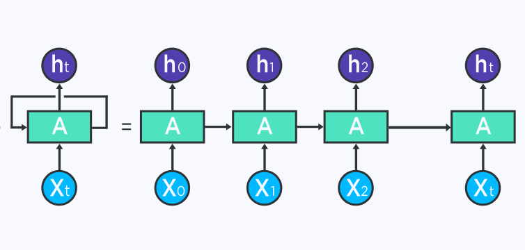

## Bi-directional RNNs

- Current state is influenced by past and <U>future</U> states

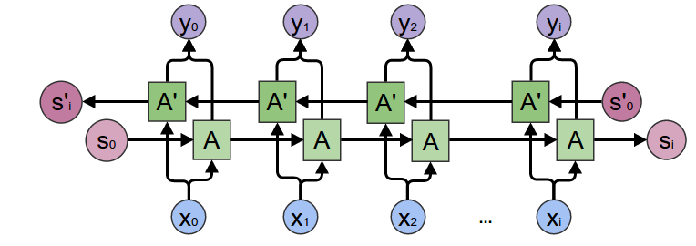

## Challenges of RNNs

:::{.incremental}
- Process one input at a time, which can make training slow
- Susceptible to the vanishing-gradient problem as memory grows
- Could be *more* context-sensitive
:::

## [Long Short-Term Memory (LSTM) Networks]{style="font-size:80%;"}

:::{.columns}
::::{.column width=35%}
:::{style="font-size:70%;"}
- Adds a "long-term memory" called the "cell state"
- Adds a series of "gates" (filters) to control how current input, short term memory, and long-term memory interact
- Gold-standard for NLP tasks from ~1997-2017
:::
::::

::::{.column width=65%}
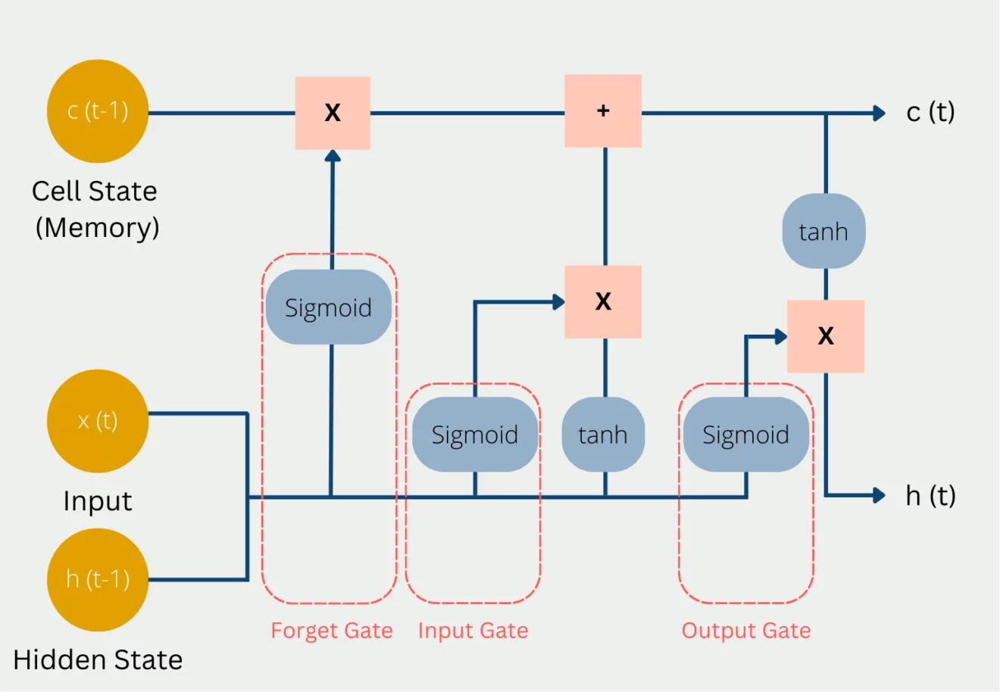
::::
:::

## LSTM Unrolled

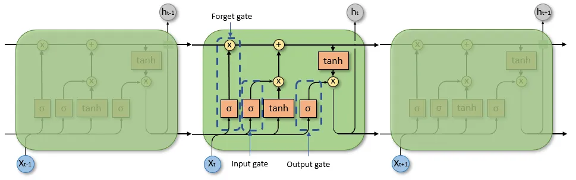

## LSTM Zoomed-in
### Each gate is a small FFN
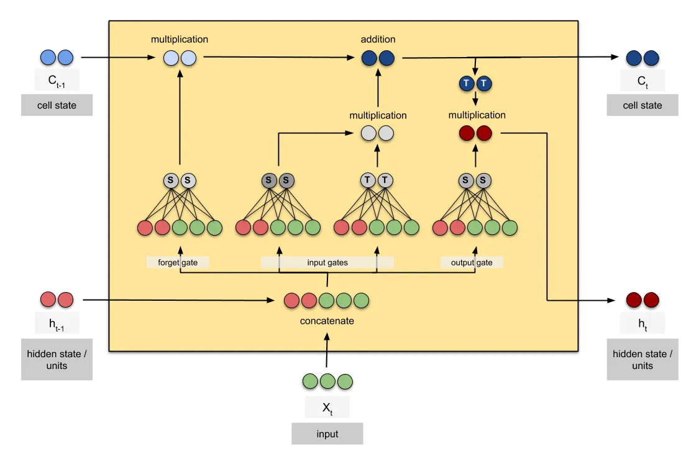

## Encoder-decoder models

:::{style="font-size:70%;" .incremental}
- RNNs can handle sequences of varying length, but the input will always have the same length as the output
- For some applications, such as translation and question-answering, we might want to allow the output to be a different length from the input
:::

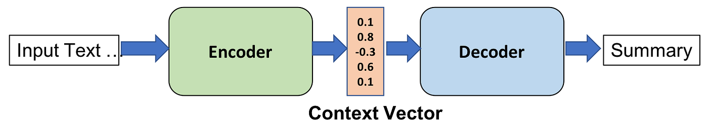

## Encoders learn text embeddings

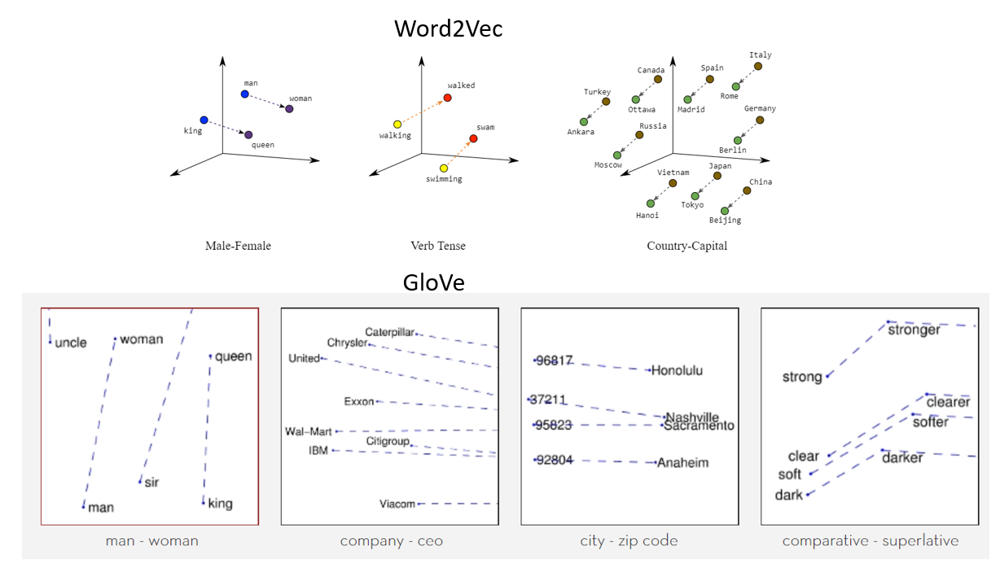

## ANN Self-Attention 

:::{style="font-size:70%;"}
- Each input can "attend" differently to every other input in a sequence
:::

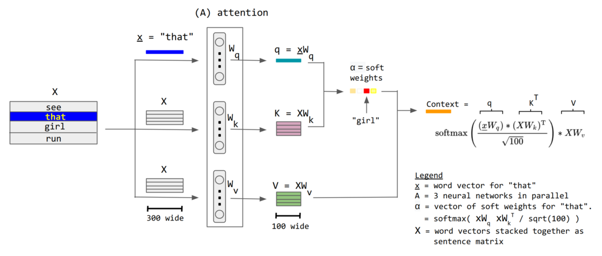

## [Multi-Head Attention & Transformers (est. 2017)]{style="font-size:80%;"}

:::{.columns}
::::{.column width=50%}
:::{style="font-size:70%;" .incremental}
- Stacks multiple attention layers, such that each attention head can learn to focus on dependencies over different lengths 
  - e.g. within-sentence dependencies vs within-conversation dependencies
- Has self-attention, but also "cross-attention"
  - Decoder side also attends to the encoder, in addition to itself
- Rather than processing inputs one at a time, Transformer models process an entire sequence in parallel
  - Helps with the problem of RNNs being slow to train

:::
::::

::::{.column width=50%}
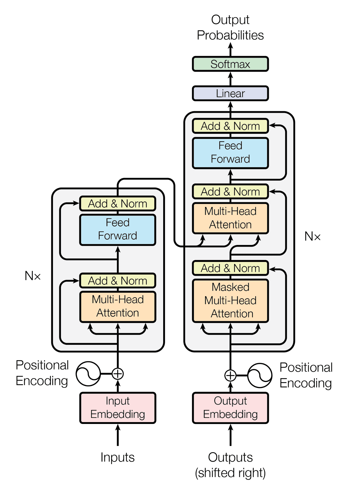{width=85%}
::::
:::

## Encoder- and Decoder-only models

:::{.columns}
::::{.column width=40%}
:::{style="font-size:50%;" .incremental}
- Encoder-only models such as **BERT** are trained through masked-token prediction
  - Only requires learning the relationships among encoded words
  - As such, they ditch the decoder step
- Decoder-only models such as **GPT** are trained on a (much more complex) version of next-word prediction
  - Their output is treated as continuation of the input
  - As such, they don't need cross-attention (just self-attention) so they ditch the encoder part
  
:::
::::

::::{.column width=60%}

::::
:::

## Diminishing returns of LLMs

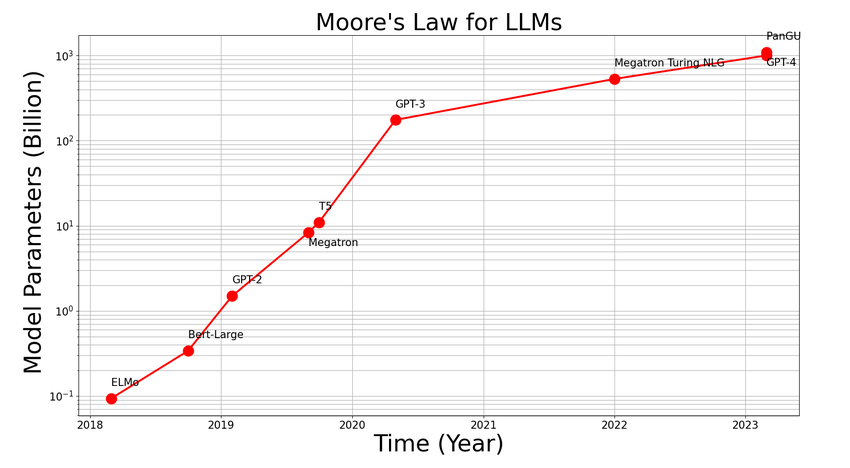

## Intractability {.small}

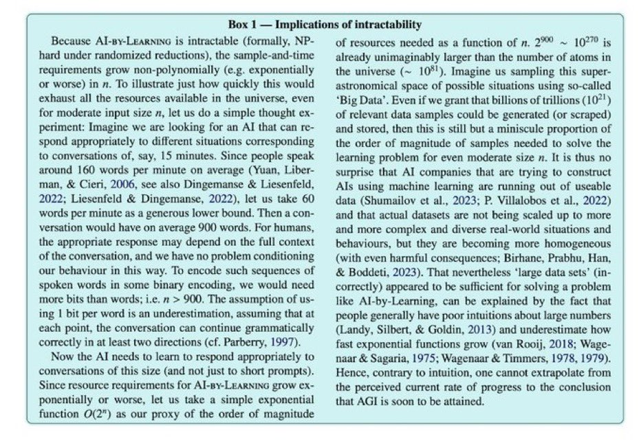

